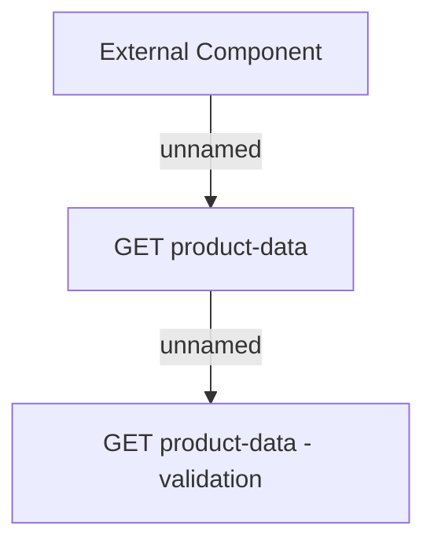

# Use Case

```mermaid
graph TD
    GET_product_data_validation["GET product-data - validation"]
    External_Component["External Component"]
    GET_product_data["GET product-data"]
    GET_product_data -->|unnamed| GET_product_data_validation
    External_Component -->|unnamed| GET_product_data
```
