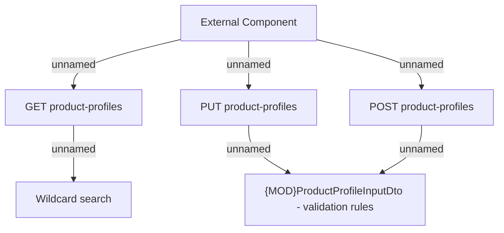

# Use Case

```mermaid
graph TD
    Wildcard_search["Wildcard search"]
    MOD_ProductProfileInputDto_validation_rules["{MOD}ProductProfileInputDto - validation rules"]
    PUT_product_profiles["PUT product-profiles"]
    POST_product_profiles["POST product-profiles"]
    GET_product_profiles["GET product-profiles"]
    External_Component["External Component"]
    PUT_product_profiles -->|unnamed| MOD_ProductProfileInputDto_validation_rules
    POST_product_profiles -->|unnamed| MOD_ProductProfileInputDto_validation_rules
    GET_product_profiles -->|unnamed| Wildcard_search
    External_Component -->|unnamed| GET_product_profiles
    External_Component -->|unnamed| PUT_product_profiles
    External_Component -->|unnamed| POST_product_profiles
```
