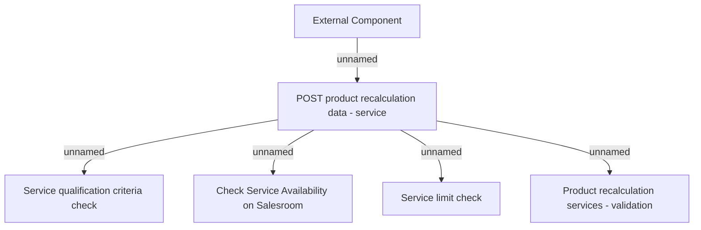

# Use Case

```mermaid
graph TD
    Product_recalculation_services_validation["Product recalculation services - validation"]
    Service_limit_check["Service limit check"]
    Check_Service_Availability_on_Salesroom["Check Service Availability on Salesroom"]
    Service_qualification_criteria_check["Service qualification criteria check"]
    POST_product_recalculation_data_service["POST product recalculation data - service"]
    External_Component["External Component"]
    POST_product_recalculation_data_service -->|unnamed| Service_qualification_criteria_check
    POST_product_recalculation_data_service -->|unnamed| Check_Service_Availability_on_Salesroom
    POST_product_recalculation_data_service -->|unnamed| Service_limit_check
    POST_product_recalculation_data_service -->|unnamed| Product_recalculation_services_validation
    External_Component -->|unnamed| POST_product_recalculation_data_service
```
