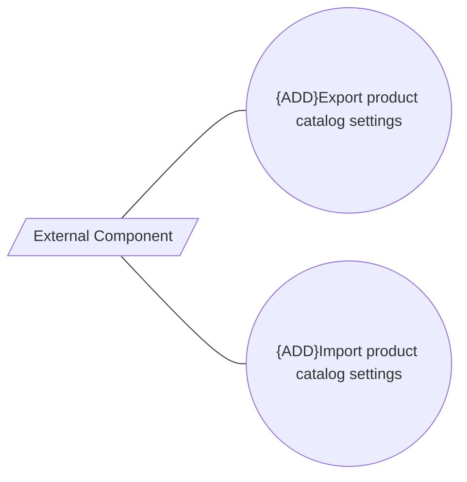

# Use Case

- **Diagram Type**: Use Case
- **Package**: HomerSelect/BSL/Modules/Product Catalog (PRC)/Interface Provided/Product Catalog REST API/Product catalog export/import/Use Case
- **Diagram ID**: 156718
- **Elements**: 3
- **Connectors**: 2

