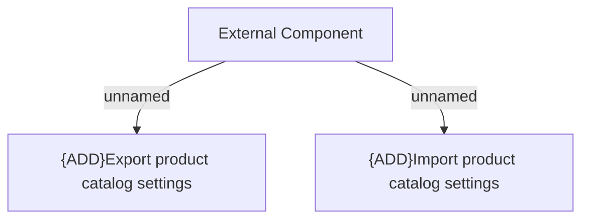

# Use Case

```mermaid
graph TD
    External_Component["External Component"]
    ADD_Import_product_catalog_settings["{ADD}Import product catalog settings"]
    ADD_Export_product_catalog_settings["{ADD}Export product catalog settings"]
    External_Component -->|unnamed| ADD_Export_product_catalog_settings
    External_Component -->|unnamed| ADD_Import_product_catalog_settings
```
