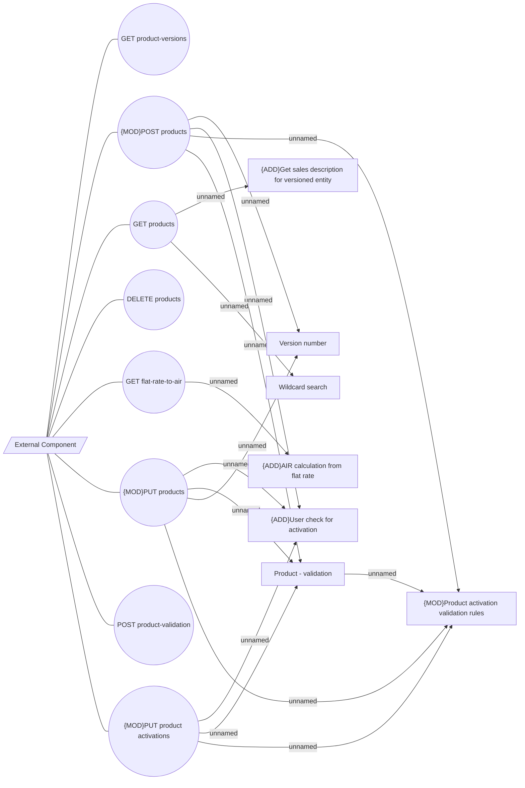

# Use Case

- **Diagram Type**: Use Case
- **Package**: HomerSelect/BSL/Modules/Product Catalog (PRC)/Interface Provided/Product Catalog REST API/Product/Use Case
- **Diagram ID**: 162337
- **Elements**: 16
- **Connectors**: 23

