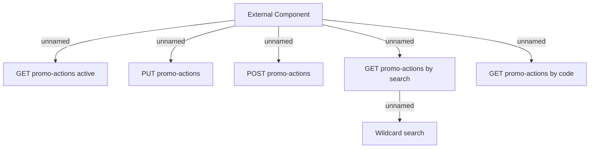

# Use Case

```mermaid
graph TD
    External_Component["External Component"]
    GET_promo_actions_active["GET promo-actions active"]
    PUT_promo_actions["PUT promo-actions"]
    POST_promo_actions["POST promo-actions"]
    Wildcard_search["Wildcard search"]
    GET_promo_actions_by_search["GET promo-actions by search"]
    GET_promo_actions_by_code["GET promo-actions by code"]
    GET_promo_actions_by_search -->|unnamed| Wildcard_search
    External_Component -->|unnamed| GET_promo_actions_by_code
    External_Component -->|unnamed| POST_promo_actions
    External_Component -->|unnamed| PUT_promo_actions
    External_Component -->|unnamed| GET_promo_actions_active
    External_Component -->|unnamed| GET_promo_actions_by_search
```
