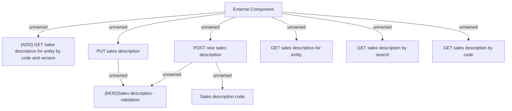

# Use Case

```mermaid
graph TD
    ADD_GET_sales_description_for_entity_by_code_and_version["{ADD} GET sales description for entity by code and version"]
    External_Component["External Component"]
    MOD_Sales_description_validation["{MOD}Sales description - validation"]
    Sales_description_code["Sales description code"]
    PUT_sales_description["PUT sales description"]
    POST_new_sales_description["POST new sales description"]
    GET_sales_description_for_entity["GET sales description for entity"]
    GET_sales_description_by_search["GET sales description by search"]
    GET_sales_description_by_code["GET sales description by code"]
    POST_new_sales_description -->|unnamed| Sales_description_code
    POST_new_sales_description -->|unnamed| MOD_Sales_description_validation
    PUT_sales_description -->|unnamed| MOD_Sales_description_validation
    External_Component -->|unnamed| GET_sales_description_by_code
    External_Component -->|unnamed| GET_sales_description_for_entity
    External_Component -->|unnamed| PUT_sales_description
    External_Component -->|unnamed| ADD_GET_sales_description_for_entity_by_code_and_version
    External_Component -->|unnamed| POST_new_sales_description
    External_Component -->|unnamed| GET_sales_description_by_search
```
