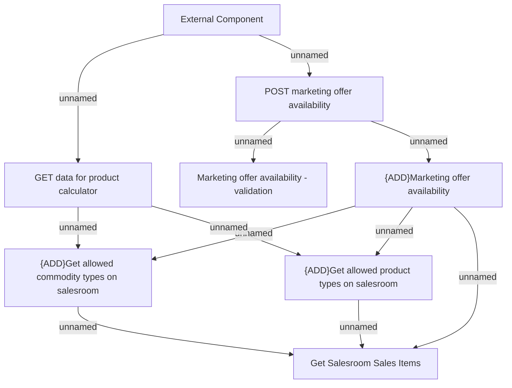

# Use Case

```mermaid
graph TD
    External_Component["External Component"]
    Get_Salesroom_Sales_Items["Get Salesroom Sales Items"]
    ADD_Get_allowed_product_types_on_salesroom["{ADD}Get allowed product types on salesroom"]
    ADD_Get_allowed_commodity_types_on_salesroom["{ADD}Get allowed commodity types on salesroom"]
    ADD_Marketing_offer_availability["{ADD}Marketing offer availability"]
    Marketing_offer_availability_validation["Marketing offer availability - validation"]
    POST_marketing_offer_availability["POST marketing offer availability"]
    GET_data_for_product_calculator["GET data for product calculator"]
    POST_marketing_offer_availability -->|unnamed| Marketing_offer_availability_validation
    POST_marketing_offer_availability -->|unnamed| ADD_Marketing_offer_availability
    ADD_Marketing_offer_availability -->|unnamed| ADD_Get_allowed_commodity_types_on_salesroom
    GET_data_for_product_calculator -->|unnamed| ADD_Get_allowed_commodity_types_on_salesroom
    GET_data_for_product_calculator -->|unnamed| ADD_Get_allowed_product_types_on_salesroom
    ADD_Marketing_offer_availability -->|unnamed| ADD_Get_allowed_product_types_on_salesroom
    ADD_Get_allowed_commodity_types_on_salesroom -->|unnamed| Get_Salesroom_Sales_Items
    ADD_Get_allowed_product_types_on_salesroom -->|unnamed| Get_Salesroom_Sales_Items
    ADD_Marketing_offer_availability -->|unnamed| Get_Salesroom_Sales_Items
    External_Component -->|unnamed| GET_data_for_product_calculator
    External_Component -->|unnamed| POST_marketing_offer_availability
```
