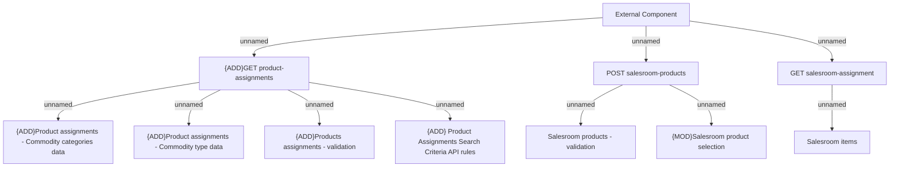

# Use Case

```mermaid
graph TD
    ADD_Product_assignments_Commodity_categories_data["{ADD}Product assignments - Commodity categories data"]
    ADD_Product_assignments_Commodity_type_data["{ADD}Product assignments - Commodity type data"]
    ADD_Products_assignments_validation["{ADD}Products assignments - validation"]
    ADD_Product_Assignments_Search_Criteria_API_rules["{ADD} Product Assignments Search Criteria API rules"]
    ADD_GET_product_assignments["{ADD}GET product-assignments"]
    External_Component["External Component"]
    Salesroom_items["Salesroom items"]
    GET_salesroom_assignment["GET salesroom-assignment"]
    MOD_Salesroom_product_selection["{MOD}Salesroom product selection"]
    Salesroom_products_validation["Salesroom products - validation"]
    POST_salesroom_products["POST salesroom-products"]
    ADD_GET_product_assignments -->|unnamed| ADD_Product_assignments_Commodity_categories_data
    ADD_GET_product_assignments -->|unnamed| ADD_Product_assignments_Commodity_type_data
    ADD_GET_product_assignments -->|unnamed| ADD_Products_assignments_validation
    ADD_GET_product_assignments -->|unnamed| ADD_Product_Assignments_Search_Criteria_API_rules
    External_Component -->|unnamed| ADD_GET_product_assignments
    External_Component -->|unnamed| POST_salesroom_products
    POST_salesroom_products -->|unnamed| Salesroom_products_validation
    POST_salesroom_products -->|unnamed| MOD_Salesroom_product_selection
    External_Component -->|unnamed| GET_salesroom_assignment
    GET_salesroom_assignment -->|unnamed| Salesroom_items
```
