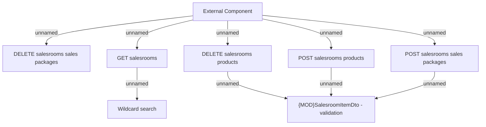

# Use Case

```mermaid
graph TD
    Wildcard_search["Wildcard search"]
    External_Component["External Component"]
    MOD_SalesroomItemDto_validation["{MOD}SalesroomItemDto - validation"]
    DELETE_salesrooms_sales_packages["DELETE salesrooms sales packages"]
    DELETE_salesrooms_products["DELETE salesrooms products"]
    POST_salesrooms_sales_packages["POST salesrooms sales packages"]
    POST_salesrooms_products["POST salesrooms products"]
    GET_salesrooms["GET salesrooms"]
    DELETE_salesrooms_products -->|unnamed| MOD_SalesroomItemDto_validation
    POST_salesrooms_products -->|unnamed| MOD_SalesroomItemDto_validation
    POST_salesrooms_sales_packages -->|unnamed| MOD_SalesroomItemDto_validation
    GET_salesrooms -->|unnamed| Wildcard_search
    External_Component -->|unnamed| GET_salesrooms
    External_Component -->|unnamed| DELETE_salesrooms_sales_packages
    External_Component -->|unnamed| POST_salesrooms_products
    External_Component -->|unnamed| POST_salesrooms_sales_packages
    External_Component -->|unnamed| DELETE_salesrooms_products
```
