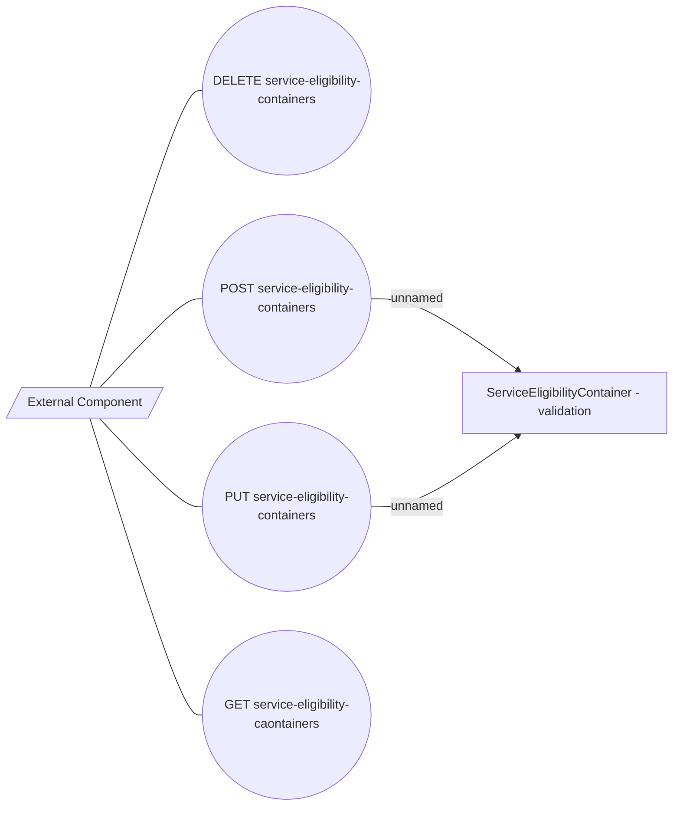

# Use Case

- **Diagram Type**: Use Case
- **Package**: HomerSelect/BSL/Modules/Product Catalog (PRC)/Interface Provided/Product Catalog REST API/Service Eligibility Containers/Use Case
- **Diagram ID**: 160588
- **Elements**: 6
- **Connectors**: 6

