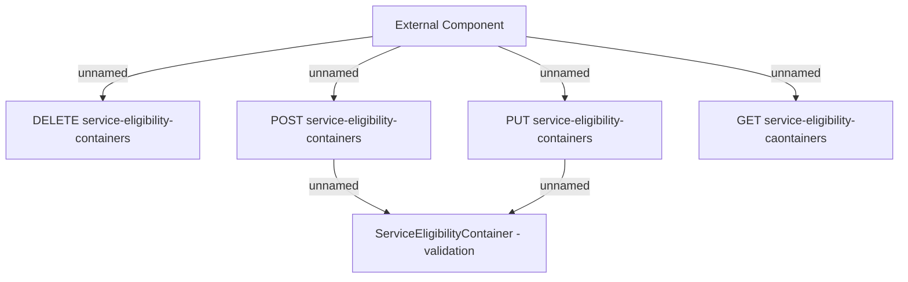

# Use Case

```mermaid
graph TD
    ServiceEligibilityContainer_validation["ServiceEligibilityContainer - validation"]
    DELETE_service_eligibility_containers["DELETE service-eligibility-containers"]
    PUT_service_eligibility_containers["PUT service-eligibility-containers"]
    POST_service_eligibility_containers["POST service-eligibility-containers"]
    External_Component["External Component"]
    GET_service_eligibility_caontainers["GET service-eligibility-caontainers"]
    POST_service_eligibility_containers -->|unnamed| ServiceEligibilityContainer_validation
    PUT_service_eligibility_containers -->|unnamed| ServiceEligibilityContainer_validation
    External_Component -->|unnamed| GET_service_eligibility_caontainers
    External_Component -->|unnamed| PUT_service_eligibility_containers
    External_Component -->|unnamed| POST_service_eligibility_containers
    External_Component -->|unnamed| DELETE_service_eligibility_containers
```
