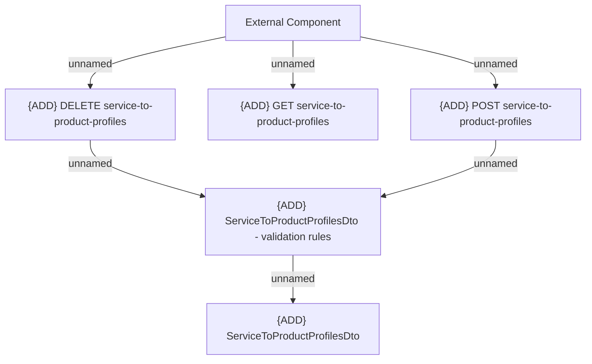

# Use Case

```mermaid
graph TD
    ADD_ServiceToProductProfilesDto_validation_rules["{ADD} ServiceToProductProfilesDto - validation rules"]
    ADD_ServiceToProductProfilesDto["{ADD} ServiceToProductProfilesDto"]
    External_Component["External Component"]
    ADD_DELETE_service_to_product_profiles["{ADD} DELETE service-to-product-profiles"]
    ADD_GET_service_to_product_profiles["{ADD} GET service-to-product-profiles"]
    ADD_POST_service_to_product_profiles["{ADD} POST service-to-product-profiles"]
    ADD_DELETE_service_to_product_profiles -->|unnamed| ADD_ServiceToProductProfilesDto_validation_rules
    ADD_POST_service_to_product_profiles -->|unnamed| ADD_ServiceToProductProfilesDto_validation_rules
    ADD_ServiceToProductProfilesDto_validation_rules -->|unnamed| ADD_ServiceToProductProfilesDto
    External_Component -->|unnamed| ADD_GET_service_to_product_profiles
    External_Component -->|unnamed| ADD_DELETE_service_to_product_profiles
    External_Component -->|unnamed| ADD_POST_service_to_product_profiles
```
