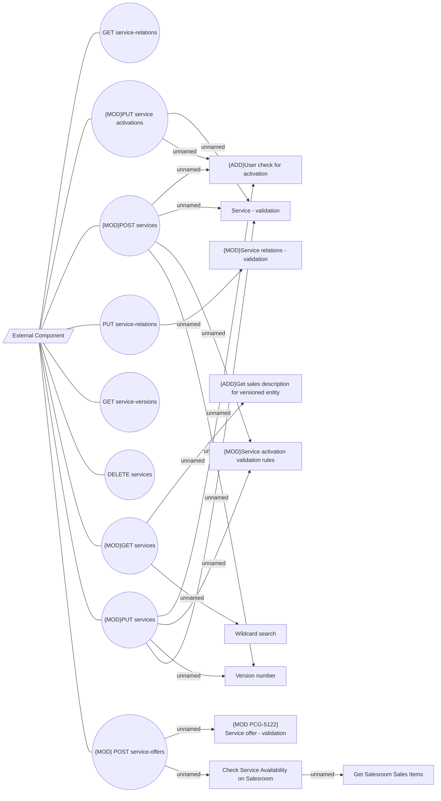

# Use Case

- **Diagram Type**: Use Case
- **Package**: HomerSelect/BSL/Modules/Product Catalog (PRC)/Interface Provided/Product Catalog REST API/Services/Use Case
- **Diagram ID**: 162983
- **Elements**: 20
- **Connectors**: 25

