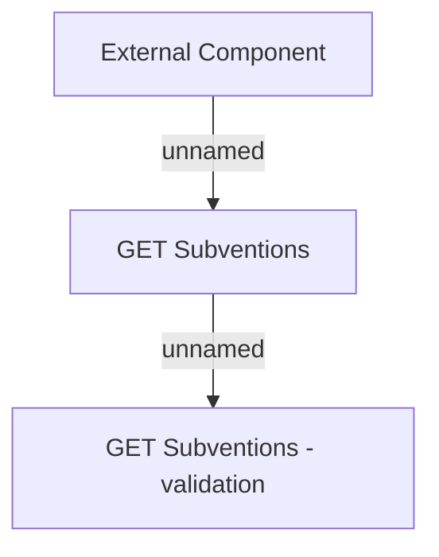

# Use Case

```mermaid
graph TD
    GET_Subventions_validation["GET Subventions - validation"]
    External_Component["External Component"]
    GET_Subventions["GET Subventions"]
    GET_Subventions -->|unnamed| GET_Subventions_validation
    External_Component -->|unnamed| GET_Subventions
```
