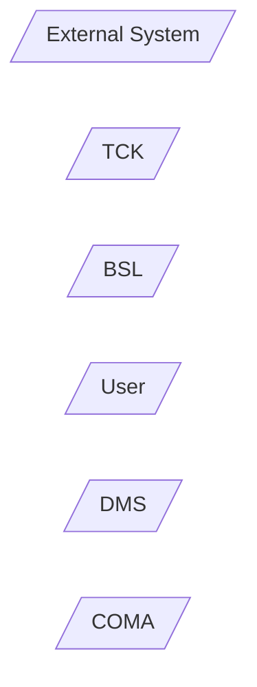

# Actors

- **Diagram Type**: Use Case
- **Package**: HomerSelect/BSL/Modules/Registration module (REM)/Actors
- **Diagram ID**: 160908
- **Elements**: 6
- **Connectors**: 0

```mermaid
graph LR
    External_System[/"External System"/]
    TCK[/"TCK"/]
    BSL[/"BSL"/]
    User[/"User"/]
    DMS[/"DMS"/]
    COMA[/"COMA"/]
```
