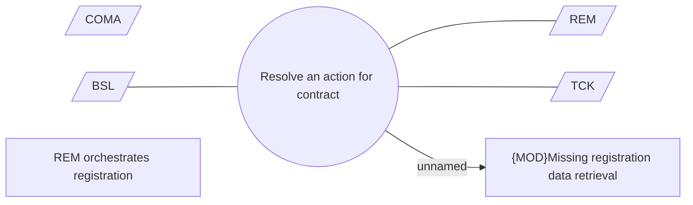

# Resolving registration action

- **Diagram Type**: Use Case
- **Package**: HomerSelect/BSL/Modules/Registration module (REM)/Analytical model/Registrations/Allocation tool orchestration
- **Diagram ID**: 161616
- **Elements**: 7
- **Connectors**: 4

