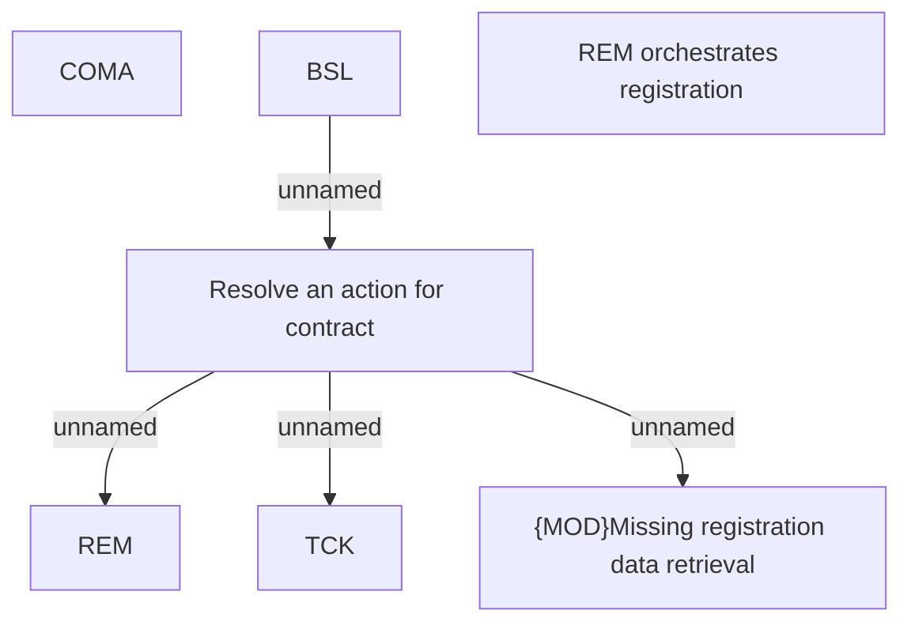

# Resolving registration action

```mermaid
graph TD
    MOD_Missing_registration_data_retrieval["{MOD}Missing registration data retrieval"]
    REM["REM"]
    TCK["TCK"]
    COMA["COMA"]
    BSL["BSL"]
    Resolve_an_action_for_contract["Resolve an action for contract"]
    REM_orchestrates_registration["REM orchestrates registration"]
    Resolve_an_action_for_contract -->|unnamed| REM
    Resolve_an_action_for_contract -->|unnamed| TCK
    Resolve_an_action_for_contract -->|unnamed| MOD_Missing_registration_data_retrieval
    BSL -->|unnamed| Resolve_an_action_for_contract
```
