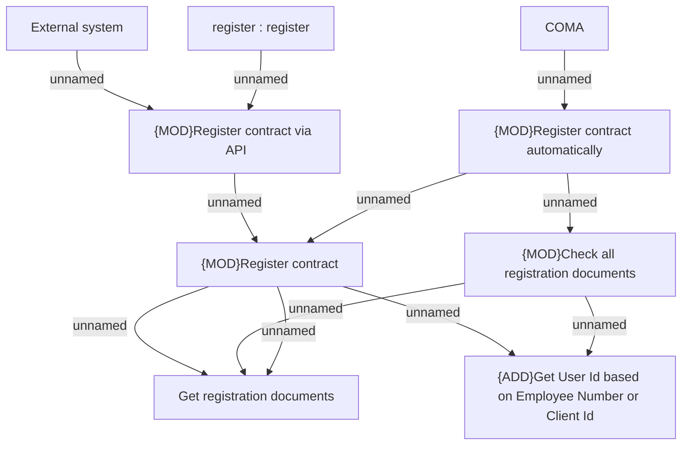

# Register contract

```mermaid
graph TD
    register_register["register : register"]
    External_system["External system"]
    ADD_Get_User_Id_based_on_Employee_Number_or_Client_Id["{ADD}Get User Id based on Employee Number or Client Id"]
    Get_registration_documents["Get registration documents"]
    MOD_Register_contract_via_API["{MOD}Register contract via  API"]
    MOD_Register_contract["{MOD}Register contract"]
    MOD_Check_all_registration_documents["{MOD}Check all registration documents"]
    COMA["COMA"]
    MOD_Register_contract_automatically["{MOD}Register contract automatically"]
    COMA -->|unnamed| MOD_Register_contract_automatically
    MOD_Register_contract_automatically -->|unnamed| MOD_Check_all_registration_documents
    MOD_Register_contract_via_API -->|unnamed| MOD_Register_contract
    MOD_Register_contract_automatically -->|unnamed| MOD_Register_contract
    External_system -->|unnamed| MOD_Register_contract_via_API
    register_register -->|unnamed| MOD_Register_contract_via_API
    MOD_Register_contract -->|unnamed| Get_registration_documents
    MOD_Check_all_registration_documents -->|unnamed| Get_registration_documents
    MOD_Register_contract -->|unnamed| Get_registration_documents
    MOD_Register_contract -->|unnamed| ADD_Get_User_Id_based_on_Employee_Number_or_Client_Id
    MOD_Check_all_registration_documents -->|unnamed| ADD_Get_User_Id_based_on_Employee_Number_or_Client_Id
```
