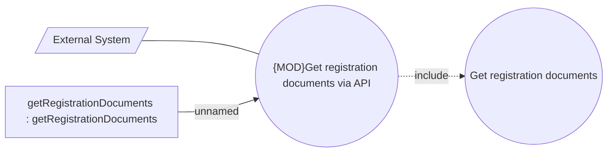

# Get registration documents

- **Diagram Type**: Use Case
- **Package**: HomerSelect/BSL/Modules/Registration module (REM)/Analytical model/Registrations/Contracts/Registration documents management/Get registration documents/Use Cases
- **Diagram ID**: 162034
- **Elements**: 4
- **Connectors**: 3

