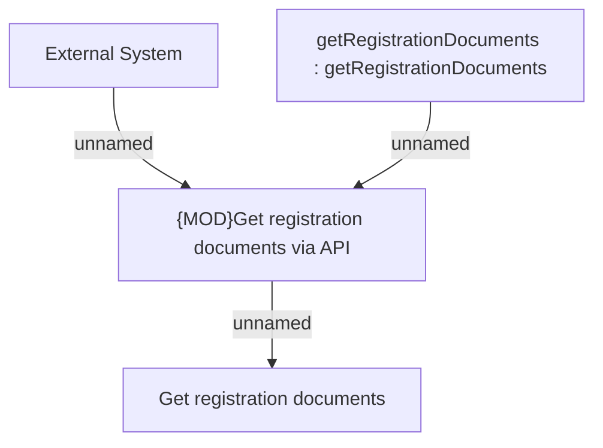

# Get registration documents

```mermaid
graph TD
    External_System["External System"]
    getRegistrationDocuments_getRegistrationDocuments["getRegistrationDocuments : getRegistrationDocuments"]
    MOD_Get_registration_documents_via_API["{MOD}Get registration documents via API"]
    Get_registration_documents["Get registration documents"]
    MOD_Get_registration_documents_via_API -->|unnamed| Get_registration_documents
    External_System -->|unnamed| MOD_Get_registration_documents_via_API
    getRegistrationDocuments_getRegistrationDocuments -->|unnamed| MOD_Get_registration_documents_via_API
```
