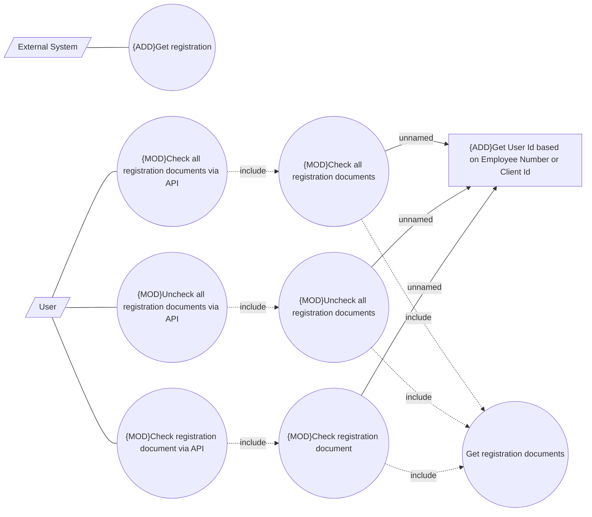

# Uncheck/Check

- **Diagram Type**: Use Case
- **Package**: HomerSelect/BSL/Modules/Registration module (REM)/Analytical model/Registrations/Contracts/Registration documents management/Uncheck/Check documents/Use Cases
- **Diagram ID**: 160756
- **Elements**: 11
- **Connectors**: 13

