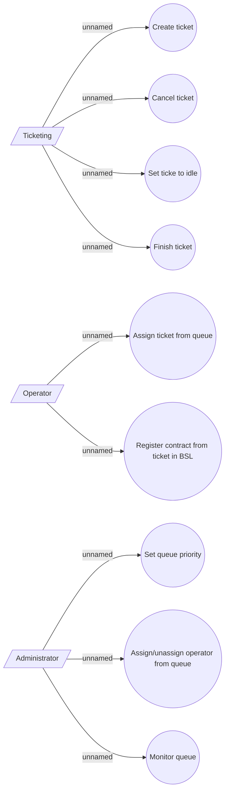

# Registration ticket managament

- **Diagram Type**: Use Case
- **Package**: HomerSelect/BSL/Modules/Registration module (REM)/Requirements/CBL-17316 (CLM-5164) Registration based on REM module/Queues management/Use case model
- **Diagram ID**: 156812
- **Elements**: 12
- **Connectors**: 9

