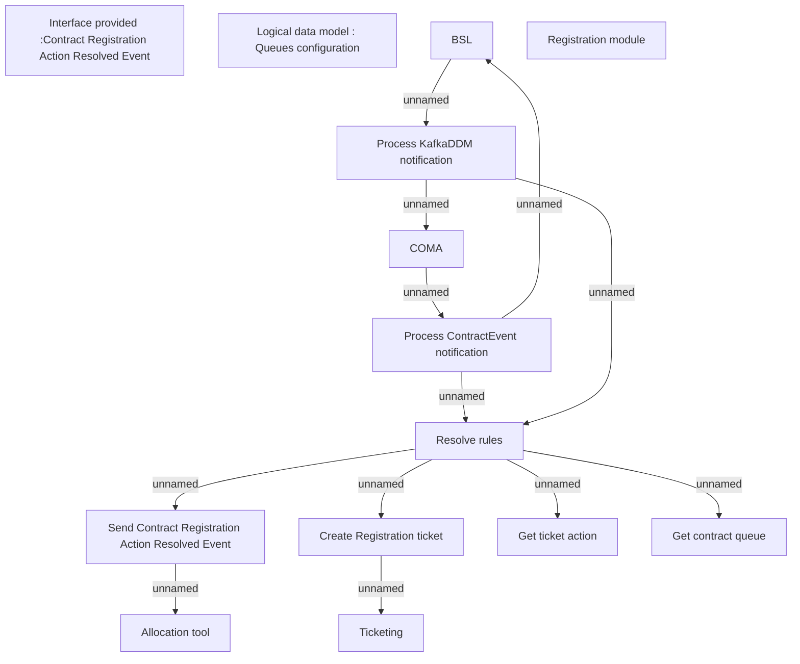

# Registration orchestration

```mermaid
graph TD
    Resolve_rules["Resolve rules"]
    Ticketing["Ticketing"]
    Create_Registration_ticket["Create Registration ticket"]
    Interface_provided_Contract_Registration_Action_Resolved_Eve["Interface provided :Contract Registration Action Resolved Event"]
    Logical_data_model_Queues_configuration["Logical data model : Queues configuration"]
    Allocation_tool["Allocation tool"]
    BSL["BSL"]
    COMA["COMA"]
    Send_Contract_Registration_Action_Resolved_Event["Send Contract Registration Action Resolved Event "]
    Get_ticket_action["Get ticket action"]
    Get_contract_queue["Get contract queue"]
    Process_ContractEvent_notification["Process ContractEvent notification"]
    Process_KafkaDDM_notification["Process KafkaDDM notification"]
    Registration_module["Registration module"]
    BSL -->|unnamed| Process_KafkaDDM_notification
    COMA -->|unnamed| Process_ContractEvent_notification
    Resolve_rules -->|unnamed| Get_contract_queue
    Resolve_rules -->|unnamed| Get_ticket_action
    Resolve_rules -->|unnamed| Send_Contract_Registration_Action_Resolved_Event
    Process_KafkaDDM_notification -->|unnamed| COMA
    Process_ContractEvent_notification -->|unnamed| BSL
    Send_Contract_Registration_Action_Resolved_Event -->|unnamed| Allocation_tool
    Resolve_rules -->|unnamed| Create_Registration_ticket
    Create_Registration_ticket -->|unnamed| Ticketing
    Process_ContractEvent_notification -->|unnamed| Resolve_rules
    Process_KafkaDDM_notification -->|unnamed| Resolve_rules
```
