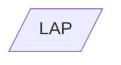

# Actors

- **Diagram Type**: Use Case
- **Package**: HomerSelect/BSL/Modules/Service Interpreter (SIR)/Analytical Model/Actors
- **Diagram ID**: 151363
- **Elements**: 1
- **Connectors**: 0

```mermaid
graph LR
    LAP[/"LAP"/]
```
