# Service Interpreter - Use Case Model

- **Diagram Type**: Use Case
- **Package**: HomerSelect/BSL/Modules/Service Interpreter (SIR)/Analytical Model/Use Case Model
- **Diagram ID**: 154221
- **Elements**: 30
- **Connectors**: 29

```mermaid
graph LR
    SIR_Cancel_Transaction_Supplement_in_BSL_Contract_Supplement["SIR - Cancel Transaction Supplement in BSL Contract Supplement"]
    SIR_Reject_Transaction_Supplement_in_BSL_Contract_Supplement["SIR - Reject Transaction Supplement in BSL Contract Supplement"]
    LAP[/"LAP"/]
    n_16_025_Process_Transaction_approval_result(("16.025 Process Transaction approval result"))
    LAP_vector_data_TRANSACTION_mapping["LAP vector data TRANSACTION mapping"]
    SIR_Cancel_Loan_Service_in_BSL_Loan_Services["SIR - Cancel Loan Service in BSL Loan Services"]
    SIR_Cancel_Insurance_service_in_BSL_Loan_Services["SIR - Cancel Insurance service in BSL Loan Services"]
    Contract_Supplement_Notifications_Contract_Supplement_Notifi["Contract Supplement Notifications : Contract Supplement Notifications"]
    SIR_Activate_Insurance_Service_on_Contract["SIR - Activate Insurance Service on Contract"]
    ServiceInterpreterProcessingResult_notification_ServiceInter["ServiceInterpreterProcessingResult notification : ServiceInterpreterProcessingResult notification"]
    Web_Services_SIR_Process_a_request_for_a_loan["Web Services : SIR - Process a request for a loan"]
    SIR_Create_Loan_Service_in_BSL_LoanService["SIR - Create Loan Service in BSL.LoanService"]
    SIR_Create_Insurance_Contract_in_BSL_Insurance["SIR - Create Insurance Contract in BSL.Insurance"]
    SIR_Authorize_transaction_requests_of_the_Transaction_Supple["SIR - Authorize transaction requests of the Transaction Supplement in AM"]
    Determine_the_Loan_Process_type_based_on_the_provided_Sales_["Determine the Loan Process type based on the provided Sales Quotes"]
    SIR_Adding_Sales_Quote_to_Transaction_Supplement["SIR - Adding Sales Quote to Transaction Supplement"]
    SIR_Get_Insurance_Program_definition_from_INSR["SIR - Get Insurance Program definition from INSR"]
    SIR_Get_Service_definitions_from_PRC_Service_Catalogue["SIR - Get Service definitions from PRC Service Catalogue"]
    SIR_Create_a_Payment_Channel_for_VAS_in_BSL_Payment_Channels["SIR - Create  a Payment Channel for VAS in BSL Payment Channels"]
    SIR_Get_Supplement_definition_from_BSL_Supplements["SIR - Get Supplement definition from BSL Supplements"]
    SIR_Create_Transaction_Supplement_in_BSL_Contract_Supplement["SIR - Create Transaction Supplement in BSL Contract Supplement"]
    SIR_Get_Account_status_by_account_number_from_AM["SIR - Get Account status by account number from AM"]
    SIR_Get_Transaction_Supplement_by_code["SIR - Get Transaction Supplement by code"]
    SIR_Get_Sales_Quotes_by_codes_from_SQS["SIR - Get Sales Quotes by codes from SQS"]
    SIR_Get_Application_data_by_code_from_ADS["SIR - Get Application data by code from ADS"]
    BSL_ContractSupplements[/"BSL.ContractSupplements"/]
    n_16_030_Process_Transaction_Supplement_notification(("16.030 Process Transaction Supplement notification"))
    n_16_020_Process_request_for_a_loan(("16.020 Process request for a loan"))
    n_16_010_Request_for_a_loan_transaction_service(("16.010 Request for a loan transaction service"))
    External_System[/"External System"/]
    n_16_020_Process_request_for_a_loan -->|unnamed| SIR_Get_Supplement_definition_from_BSL_Supplements
    n_16_025_Process_Transaction_approval_result -->|unnamed| SIR_Reject_Transaction_Supplement_in_BSL_Contract_Supplement
    LAP --> n_16_025_Process_Transaction_approval_result
    n_16_030_Process_Transaction_Supplement_notification -->|unnamed| SIR_Cancel_Loan_Service_in_BSL_Loan_Services
    n_16_030_Process_Transaction_Supplement_notification -->|unnamed| SIR_Cancel_Insurance_service_in_BSL_Loan_Services
    n_16_030_Process_Transaction_Supplement_notification -->|unnamed| SIR_Activate_Insurance_Service_on_Contract
    n_16_020_Process_request_for_a_loan -->|unnamed| SIR_Create_Loan_Service_in_BSL_LoanService
    n_16_020_Process_request_for_a_loan -->|unnamed| SIR_Create_Insurance_Contract_in_BSL_Insurance
    n_16_025_Process_Transaction_approval_result -->|unnamed| SIR_Authorize_transaction_requests_of_the_Transaction_Supple
    n_16_020_Process_request_for_a_loan -->|unnamed| SIR_Authorize_transaction_requests_of_the_Transaction_Supple
    n_16_020_Process_request_for_a_loan -->|unnamed| Determine_the_Loan_Process_type_based_on_the_provided_Sales_
    n_16_020_Process_request_for_a_loan -->|unnamed| SIR_Adding_Sales_Quote_to_Transaction_Supplement
    n_16_020_Process_request_for_a_loan -->|unnamed| SIR_Get_Insurance_Program_definition_from_INSR
    n_16_025_Process_Transaction_approval_result -->|unnamed| SIR_Cancel_Transaction_Supplement_in_BSL_Contract_Supplement
    n_16_020_Process_request_for_a_loan -->|unnamed| SIR_Create_a_Payment_Channel_for_VAS_in_BSL_Payment_Channels
    Web_Services_SIR_Process_a_request_for_a_loan -->|unnamed| n_16_010_Request_for_a_loan_transaction_service
    n_16_020_Process_request_for_a_loan -->|unnamed| SIR_Create_Transaction_Supplement_in_BSL_Contract_Supplement
    n_16_010_Request_for_a_loan_transaction_service -->|unnamed| SIR_Get_Account_status_by_account_number_from_AM
    n_16_010_Request_for_a_loan_transaction_service -->|unnamed| SIR_Get_Transaction_Supplement_by_code
    n_16_020_Process_request_for_a_loan -->|unnamed| SIR_Get_Transaction_Supplement_by_code
    n_16_020_Process_request_for_a_loan -->|unnamed| SIR_Get_Sales_Quotes_by_codes_from_SQS
    n_16_030_Process_Transaction_Supplement_notification -->|unnamed| SIR_Get_Sales_Quotes_by_codes_from_SQS
    n_16_010_Request_for_a_loan_transaction_service -->|unnamed| SIR_Get_Application_data_by_code_from_ADS
    BSL_ContractSupplements --> n_16_030_Process_Transaction_Supplement_notification
    Contract_Supplement_Notifications_Contract_Supplement_Notifi -->|unnamed| n_16_030_Process_Transaction_Supplement_notification
    ServiceInterpreterProcessingResult_notification_ServiceInter -->|unnamed| n_16_020_Process_request_for_a_loan
    n_16_010_Request_for_a_loan_transaction_service -->|unnamed| n_16_020_Process_request_for_a_loan
    External_System --> n_16_010_Request_for_a_loan_transaction_service
    n_16_020_Process_request_for_a_loan -->|unnamed| SIR_Get_Service_definitions_from_PRC_Service_Catalogue
```

