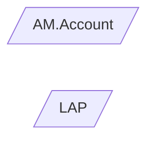

# Actors

- **Diagram Type**: Use Case
- **Package**: HomerSelect/BSL/Modules/Service Interpreter (SIR_NG)/Analytical Model/Actors
- **Diagram ID**: 163688
- **Elements**: 2
- **Connectors**: 0

```mermaid
graph LR
    AM_Account[/"AM.Account"/]
    LAP[/"LAP"/]
```
