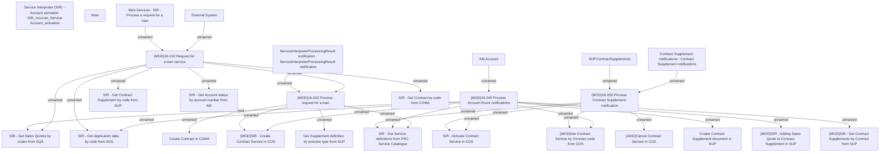

# Account origination - Use Case Model

```mermaid
graph TD
    ADD_Cancel_Contract_Service_in_COS["{ADD}Cancel Contract Service in COS"]
    Get_Supplement_definition_by_process_type_from_SUP["Get Supplement definition by process type from SUP"]
    Create_Contract_in_COMA["Create Contract in COMA"]
    SIR_Activate_Contract_Service_in_COS["SIR - Activate Contract Service in COS"]
    Contract_Supplement_notifications_Contract_Supplement_notifi["Contract Supplement notifications : Contract Supplement notifications"]
    MOD_16_050_Process_Contract_Supplement_notification["{MOD}16.050 Process Contract Supplement notification"]
    Service_Interpreter_SIR_Account_activation_SIR_Account_Servi["Service Interpreter (SIR) - Account activation :SIR_Account_Service-Account_activation"]
    MOD_SIR_Create_Contract_Service_in_COS["{MOD}SIR - Create Contract Service in COS"]
    Create_Contract_Supplement_document_in_SUP["Create Contract Supplement document in SUP"]
    el_1872755["Note"]
    MOD_SIR_Adding_Sales_Quote_to_Contract_Supplement_in_SUP["{MOD}SIR - Adding Sales Quote to Contract Supplement in SUP"]
    MOD_Get_Contract_Service_by_Contract_code_from_COS["{MOD}Get Contract Service by Contract code from COS"]
    MOD_SIR_Get_Contract_Supplements_by_Contract_from_SUP["{MOD}SIR - Get Contract Supplements by Contract from SUP"]
    AM_Account["AM.Account"]
    MOD_16_040_Process_Account_Event_notifications["{MOD}16.040 Process Account Event notifications"]
    SIR_Get_Contract_Supplement_by_code_from_SUP["SIR - Get Contract Supplement by code from SUP"]
    ServiceInterpreterProcessingResult_notification_ServiceInter["ServiceInterpreterProcessingResult notification : ServiceInterpreterProcessingResult notification"]
    Web_Services_SIR_Process_a_request_for_a_loan["Web Services : SIR - Process a request for a loan"]
    SIR_Get_Service_definitions_from_PRC_Service_Catalogue["SIR - Get Service definitions from PRC Service Catalogue"]
    SIR_Get_Account_status_by_account_number_from_AM["SIR - Get Account status by account number from AM"]
    SIR_Get_Sales_Quotes_by_codes_from_SQS["SIR - Get Sales Quotes by codes from SQS"]
    SIR_Get_Application_data_by_code_from_ADS["SIR - Get Application data by code from ADS"]
    SUP_ContractSupplements["SUP.ContractSupplements"]
    MOD_16_020_Process_request_for_a_loan["{MOD}16.020 Process request for a loan"]
    MOD_16_010_Request_for_a_loan_service["{MOD}16.010 Request for a loan service"]
    SIR_Get_Contract_by_code_from_COMA["SIR - Get Contract by code from COMA"]
    External_System["External System"]
    MOD_16_050_Process_Contract_Supplement_notification -->|unnamed| SIR_Get_Service_definitions_from_PRC_Service_Catalogue
    MOD_16_020_Process_request_for_a_loan -->|unnamed| Create_Contract_in_COMA
    MOD_16_050_Process_Contract_Supplement_notification -->|unnamed| SIR_Activate_Contract_Service_in_COS
    MOD_16_040_Process_Account_Event_notifications -->|unnamed| SIR_Activate_Contract_Service_in_COS
    SUP_ContractSupplements -->|unnamed| MOD_16_050_Process_Contract_Supplement_notification
    Contract_Supplement_notifications_Contract_Supplement_notifi -->|unnamed| MOD_16_050_Process_Contract_Supplement_notification
    MOD_16_020_Process_request_for_a_loan -->|unnamed| MOD_SIR_Create_Contract_Service_in_COS
    MOD_16_040_Process_Account_Event_notifications -->|unnamed| MOD_SIR_Create_Contract_Service_in_COS
    MOD_16_040_Process_Account_Event_notifications -->|unnamed| Create_Contract_Supplement_document_in_SUP
    MOD_16_040_Process_Account_Event_notifications -->|unnamed| MOD_SIR_Adding_Sales_Quote_to_Contract_Supplement_in_SUP
    MOD_16_050_Process_Contract_Supplement_notification -->|unnamed| MOD_Get_Contract_Service_by_Contract_code_from_COS
    MOD_16_040_Process_Account_Event_notifications -->|unnamed| MOD_Get_Contract_Service_by_Contract_code_from_COS
    MOD_16_040_Process_Account_Event_notifications -->|unnamed| MOD_SIR_Get_Contract_Supplements_by_Contract_from_SUP
    MOD_16_020_Process_request_for_a_loan -->|unnamed| Get_Supplement_definition_by_process_type_from_SUP
    MOD_16_010_Request_for_a_loan_service -->|unnamed| SIR_Get_Contract_Supplement_by_code_from_SUP
    MOD_16_050_Process_Contract_Supplement_notification -->|unnamed| ADD_Cancel_Contract_Service_in_COS
    MOD_16_040_Process_Account_Event_notifications -->|unnamed| SIR_Get_Service_definitions_from_PRC_Service_Catalogue
    MOD_16_020_Process_request_for_a_loan -->|unnamed| SIR_Get_Service_definitions_from_PRC_Service_Catalogue
    MOD_16_010_Request_for_a_loan_service -->|unnamed| SIR_Get_Account_status_by_account_number_from_AM
    MOD_16_040_Process_Account_Event_notifications -->|unnamed| SIR_Get_Sales_Quotes_by_codes_from_SQS
    MOD_16_010_Request_for_a_loan_service -->|unnamed| SIR_Get_Sales_Quotes_by_codes_from_SQS
    MOD_16_010_Request_for_a_loan_service -->|unnamed| SIR_Get_Application_data_by_code_from_ADS
    MOD_16_040_Process_Account_Event_notifications -->|unnamed| SIR_Get_Application_data_by_code_from_ADS
    ServiceInterpreterProcessingResult_notification_ServiceInter -->|unnamed| MOD_16_020_Process_request_for_a_loan
    MOD_16_010_Request_for_a_loan_service -->|unnamed| MOD_16_020_Process_request_for_a_loan
    Web_Services_SIR_Process_a_request_for_a_loan -->|unnamed| MOD_16_010_Request_for_a_loan_service
    External_System -->|unnamed| MOD_16_010_Request_for_a_loan_service
    MOD_16_010_Request_for_a_loan_service -->|unnamed| SIR_Get_Contract_by_code_from_COMA
    AM_Account -->|unnamed| MOD_16_040_Process_Account_Event_notifications
```
