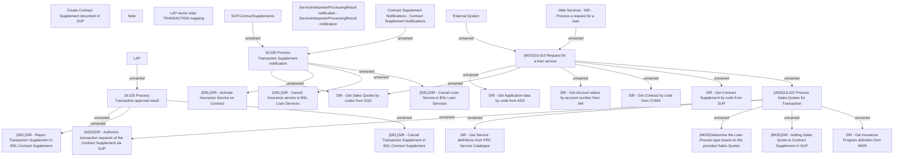

# Transaction origination - Use Case Model

```mermaid
graph TD
    Create_Contract_Supplement_document_in_SUP["Create Contract Supplement document in SUP"]
    el_1872755["Note"]
    MOD_SIR_Adding_Sales_Quote_to_Contract_Supplement_in_SUP["{MOD}SIR - Adding Sales Quote to Contract Supplement in SUP"]
    ADD_16_022_Process_Sales_Quotes_for_Transaction["{ADD}16.022 Process Sales Quotes for Transaction"]
    SIR_Get_Contract_Supplement_by_code_from_SUP["SIR - Get Contract Supplement by code from SUP"]
    DEL_SIR_Cancel_Transaction_Supplement_in_BSL_Contract_Supple["{DEL}SIR - Cancel Transaction Supplement in BSL Contract Supplement"]
    DEL_SIR_Reject_Transaction_Supplement_in_BSL_Contract_Supple["{DEL}SIR - Reject Transaction Supplement in BSL Contract Supplement"]
    LAP["LAP"]
    n_16_025_Process_Transaction_approval_result["16.025 Process Transaction approval result"]
    LAP_vector_data_TRANSACTION_mapping["LAP vector data TRANSACTION mapping"]
    DEL_SIR_Cancel_Loan_Service_in_BSL_Loan_Services["{DEL}SIR - Cancel Loan Service in BSL Loan Services"]
    DEL_SIR_Cancel_Insurance_service_in_BSL_Loan_Services["{DEL}SIR - Cancel Insurance service in BSL Loan Services"]
    Contract_Supplement_Notifications_Contract_Supplement_Notifi["Contract Supplement Notifications : Contract Supplement Notifications"]
    DEL_SIR_Activate_Insurance_Service_on_Contract["{DEL}SIR - Activate Insurance Service on Contract"]
    ServiceInterpreterProcessingResult_notification_ServiceInter["ServiceInterpreterProcessingResult notification : ServiceInterpreterProcessingResult notification"]
    Web_Services_SIR_Process_a_request_for_a_loan["Web Services : SIR - Process a request for a loan"]
    ADD_SIR_Authorize_transaction_requests_of_the_Contract_Suppl["{ADD}SIR - Authorize transaction requests of the Contract Supplement via SUP"]
    MOD_Determine_the_Loan_Process_type_based_on_the_provided_Sa["{MOD}Determine the Loan Process type based on the provided Sales Quotes"]
    SIR_Get_Insurance_Program_definition_from_INSR["SIR - Get Insurance Program definition from INSR"]
    SIR_Get_Service_definitions_from_PRC_Service_Catalogue["SIR - Get Service definitions from PRC Service Catalogue"]
    SIR_Get_Account_status_by_account_number_from_AM["SIR - Get Account status by account number from AM"]
    SIR_Get_Sales_Quotes_by_codes_from_SQS["SIR - Get Sales Quotes by codes from SQS"]
    SIR_Get_Application_data_by_code_from_ADS["SIR - Get Application data by code from ADS"]
    SUP_ContractSupplements["SUP.ContractSupplements"]
    n_16_030_Process_Transaction_Supplement_notification["16.030 Process Transaction Supplement notification"]
    MOD_16_010_Request_for_a_loan_service["{MOD}16.010 Request for a loan service"]
    SIR_Get_Contract_by_code_from_COMA["SIR - Get Contract by code from COMA"]
    External_System["External System"]
    ADD_16_022_Process_Sales_Quotes_for_Transaction -->|unnamed| SIR_Get_Insurance_Program_definition_from_INSR
    MOD_16_010_Request_for_a_loan_service -->|unnamed| ADD_16_022_Process_Sales_Quotes_for_Transaction
    MOD_16_010_Request_for_a_loan_service -->|unnamed| SIR_Get_Contract_Supplement_by_code_from_SUP
    n_16_025_Process_Transaction_approval_result -->|unnamed| DEL_SIR_Cancel_Transaction_Supplement_in_BSL_Contract_Supple
    n_16_025_Process_Transaction_approval_result -->|unnamed| DEL_SIR_Reject_Transaction_Supplement_in_BSL_Contract_Supple
    LAP -->|unnamed| n_16_025_Process_Transaction_approval_result
    n_16_030_Process_Transaction_Supplement_notification -->|unnamed| DEL_SIR_Cancel_Loan_Service_in_BSL_Loan_Services
    n_16_030_Process_Transaction_Supplement_notification -->|unnamed| DEL_SIR_Cancel_Insurance_service_in_BSL_Loan_Services
    n_16_030_Process_Transaction_Supplement_notification -->|unnamed| DEL_SIR_Activate_Insurance_Service_on_Contract
    n_16_025_Process_Transaction_approval_result -->|unnamed| ADD_SIR_Authorize_transaction_requests_of_the_Contract_Suppl
    ADD_16_022_Process_Sales_Quotes_for_Transaction -->|unnamed| MOD_SIR_Adding_Sales_Quote_to_Contract_Supplement_in_SUP
    ADD_16_022_Process_Sales_Quotes_for_Transaction -->|unnamed| MOD_Determine_the_Loan_Process_type_based_on_the_provided_Sa
    MOD_16_010_Request_for_a_loan_service -->|unnamed| SIR_Get_Contract_by_code_from_COMA
    ADD_16_022_Process_Sales_Quotes_for_Transaction -->|unnamed| SIR_Get_Service_definitions_from_PRC_Service_Catalogue
    MOD_16_010_Request_for_a_loan_service -->|unnamed| SIR_Get_Account_status_by_account_number_from_AM
    MOD_16_010_Request_for_a_loan_service -->|unnamed| SIR_Get_Sales_Quotes_by_codes_from_SQS
    n_16_030_Process_Transaction_Supplement_notification -->|unnamed| SIR_Get_Sales_Quotes_by_codes_from_SQS
    MOD_16_010_Request_for_a_loan_service -->|unnamed| SIR_Get_Application_data_by_code_from_ADS
    Contract_Supplement_Notifications_Contract_Supplement_Notifi -->|unnamed| n_16_030_Process_Transaction_Supplement_notification
    SUP_ContractSupplements -->|unnamed| n_16_030_Process_Transaction_Supplement_notification
    Web_Services_SIR_Process_a_request_for_a_loan -->|unnamed| MOD_16_010_Request_for_a_loan_service
    External_System -->|unnamed| MOD_16_010_Request_for_a_loan_service
    ADD_16_022_Process_Sales_Quotes_for_Transaction -->|unnamed| ADD_SIR_Authorize_transaction_requests_of_the_Contract_Suppl
```
