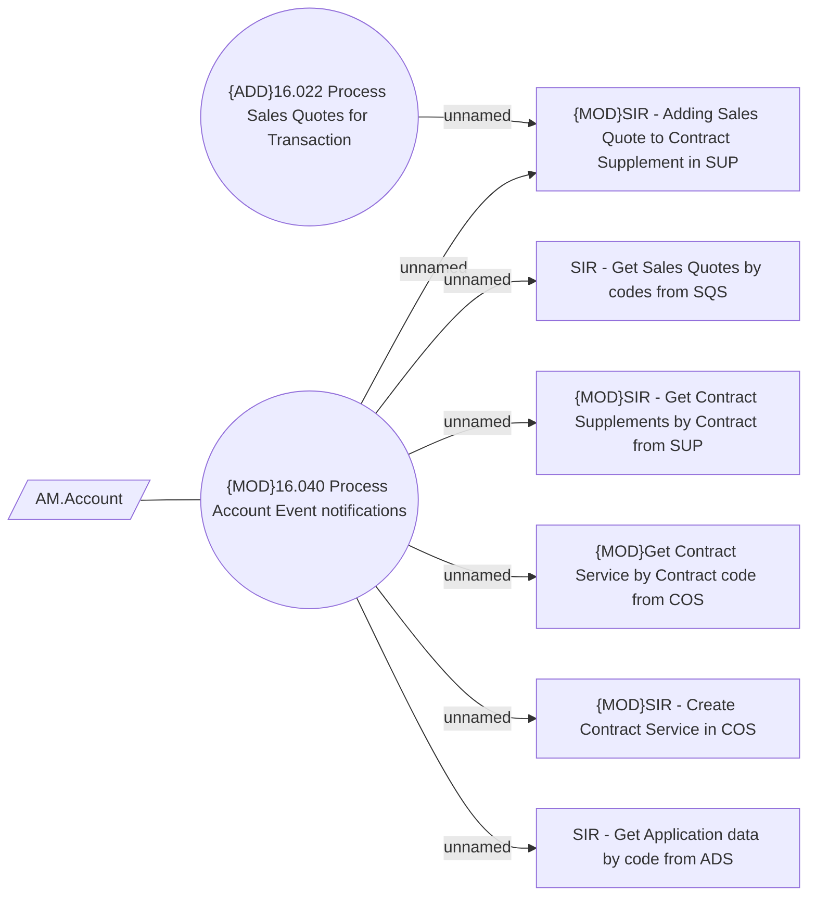

# SIR - Processing of Account Event notifications

- **Diagram Type**: Use Case
- **Package**: HomerSelect/BSL/Modules/Service Interpreter (SIR_NG)/Requirement Model/CBL-27126 BREIT-82 - COMA, SUP, COS, SIR MVP Functionalities
- **Diagram ID**: 161634
- **Elements**: 9
- **Connectors**: 8

