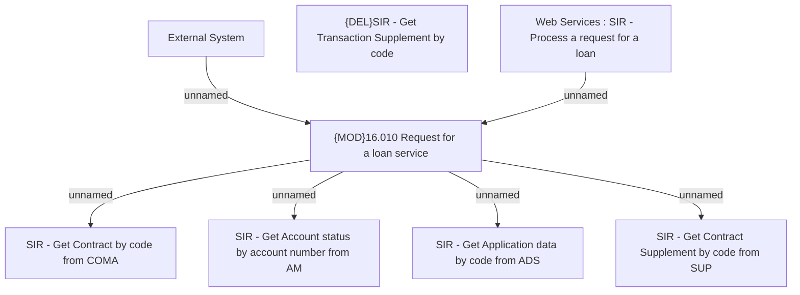

# SIR - Update process-loan API method - use cases

```mermaid
graph TD
    SIR_Get_Contract_Supplement_by_code_from_SUP["SIR - Get Contract Supplement by code from SUP"]
    Web_Services_SIR_Process_a_request_for_a_loan["Web Services : SIR - Process a request for a loan"]
    SIR_Get_Account_status_by_account_number_from_AM["SIR - Get Account status by account number from AM"]
    DEL_SIR_Get_Transaction_Supplement_by_code["{DEL}SIR - Get Transaction Supplement by code"]
    SIR_Get_Application_data_by_code_from_ADS["SIR - Get Application data by code from ADS"]
    MOD_16_010_Request_for_a_loan_service["{MOD}16.010 Request for a loan service"]
    SIR_Get_Contract_by_code_from_COMA["SIR - Get Contract by code from COMA"]
    External_System["External System"]
    MOD_16_010_Request_for_a_loan_service -->|unnamed| SIR_Get_Contract_by_code_from_COMA
    MOD_16_010_Request_for_a_loan_service -->|unnamed| SIR_Get_Account_status_by_account_number_from_AM
    MOD_16_010_Request_for_a_loan_service -->|unnamed| SIR_Get_Application_data_by_code_from_ADS
    MOD_16_010_Request_for_a_loan_service -->|unnamed| SIR_Get_Contract_Supplement_by_code_from_SUP
    External_System -->|unnamed| MOD_16_010_Request_for_a_loan_service
    Web_Services_SIR_Process_a_request_for_a_loan -->|unnamed| MOD_16_010_Request_for_a_loan_service
```
