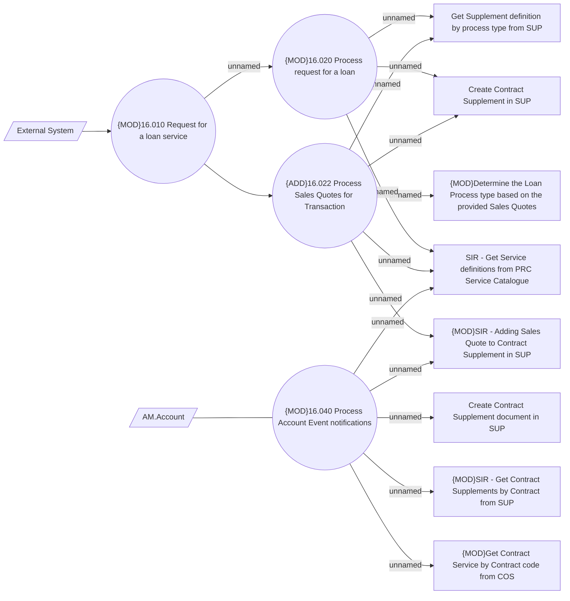

# SIR - Process Sales Quotes for Transaction

- **Diagram Type**: Use Case
- **Package**: HomerSelect/BSL/Modules/Service Interpreter (SIR_NG)/Requirement Model/CBL-28824 DOBA-76 Contract management - SIR, SUP, COMA, COS
- **Diagram ID**: 163690
- **Elements**: 14
- **Connectors**: 17

