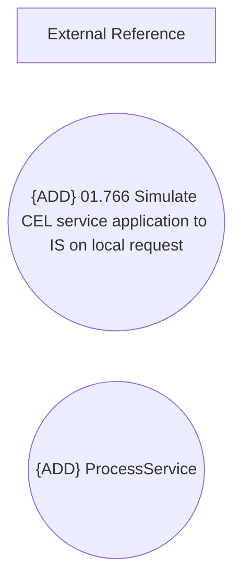

# Service processing

- **Diagram Type**: Use Case
- **Package**: HomerSelect/BSL/Modules/ServiceProcessing/TBD_Use case model
- **Diagram ID**: 86461
- **Elements**: 4
- **Connectors**: 0

```mermaid
graph LR
    External_Reference["External Reference"]
    External_Reference["External Reference"]
    ADD_01_766_Simulate_CEL_service_application_to_IS_on_local_r(("{ADD} 01.766 Simulate CEL service application to IS on local request"))
    ADD_ProcessService(("{ADD} ProcessService"))
```
