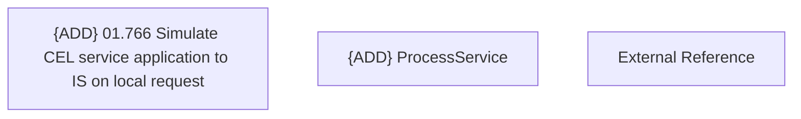

# Service processing

```mermaid
graph TD
    ADD_01_766_Simulate_CEL_service_application_to_IS_on_local_r["{ADD} 01.766 Simulate CEL service application to IS on local request"]
    ADD_ProcessService["{ADD} ProcessService"]
    External_Reference["External Reference"]
    External_Reference["External Reference"]
```
