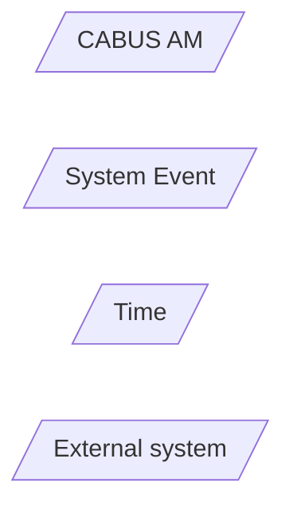

# Actors

- **Diagram Type**: Use Case
- **Package**: HomerSelect/BSL/Modules/Supplements (SUP_NG)/Analytical Model/Actors
- **Diagram ID**: 162825
- **Elements**: 4
- **Connectors**: 0

```mermaid
graph LR
    CABUS_AM[/"CABUS AM"/]
    System_Event[/"System Event"/]
    Time[/"Time"/]
    External_system[/"External system"/]
```
