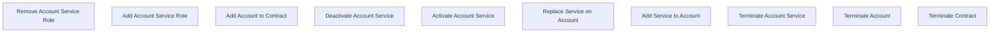

# Contract Supplements

```mermaid
graph TD
    Remove_Account_Service_Role["Remove Account Service Role"]
    Add_Account_Service_Role["Add Account Service Role"]
    Add_Account_to_Contract["Add Account to Contract"]
    Deactivate_Account_Service["Deactivate Account Service"]
    Activate_Account_Service["Activate Account Service"]
    Replace_Service_on_Account["Replace Service on Account"]
    Add_Service_to_Account["Add Service to Account"]
    Terminate_Account_Service["Terminate Account Service"]
    Terminate_Account["Terminate Account"]
    Terminate_Contract["Terminate Contract"]
```
