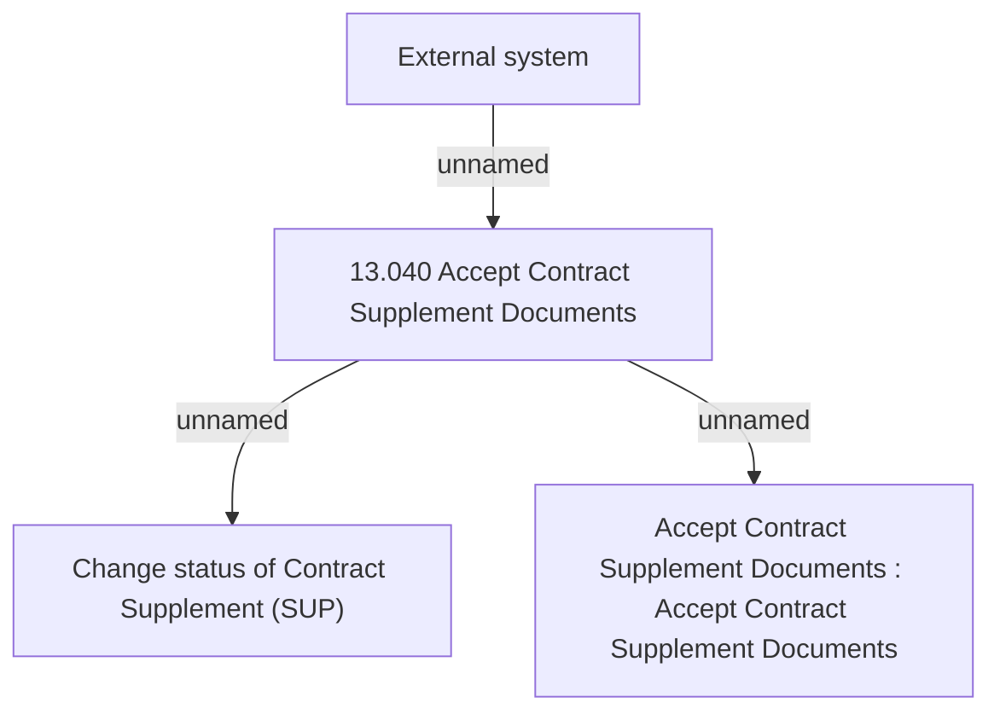

# Accept Contract Supplement Documents - Use Case Model

```mermaid
graph TD
    Accept_Contract_Supplement_Documents_Accept_Contract_Supplem["Accept Contract Supplement Documents : Accept Contract Supplement Documents"]
    Change_status_of_Contract_Supplement_SUP["Change status of Contract Supplement (SUP)"]
    External_system["External system"]
    n_13_040_Accept_Contract_Supplement_Documents["13.040 Accept Contract Supplement Documents"]
    External_system -->|unnamed| n_13_040_Accept_Contract_Supplement_Documents
    n_13_040_Accept_Contract_Supplement_Documents -->|unnamed| Change_status_of_Contract_Supplement_SUP
    n_13_040_Accept_Contract_Supplement_Documents -->|unnamed| Accept_Contract_Supplement_Documents_Accept_Contract_Supplem
```
