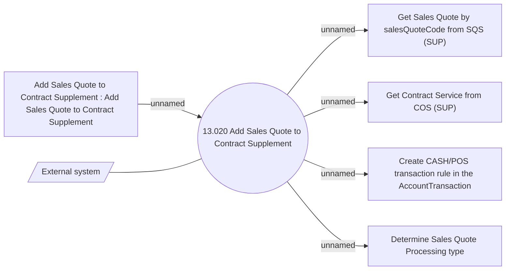

# Add Sales Quote to Contract Supplement - Use Case Model

- **Diagram Type**: Use Case
- **Package**: HomerSelect/BSL/Modules/Supplements (SUP_NG)/Analytical Model/Contract Supplements/Use Case Model
- **Diagram ID**: 163940
- **Elements**: 7
- **Connectors**: 6

