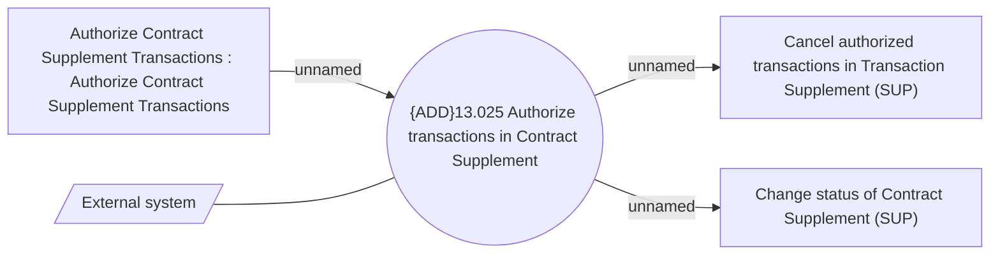

# Authorize Contract Supplement Transactions - Use Case Model

- **Diagram Type**: Use Case
- **Package**: HomerSelect/BSL/Modules/Supplements (SUP_NG)/Analytical Model/Contract Supplements/Use Case Model
- **Diagram ID**: 163945
- **Elements**: 5
- **Connectors**: 4

