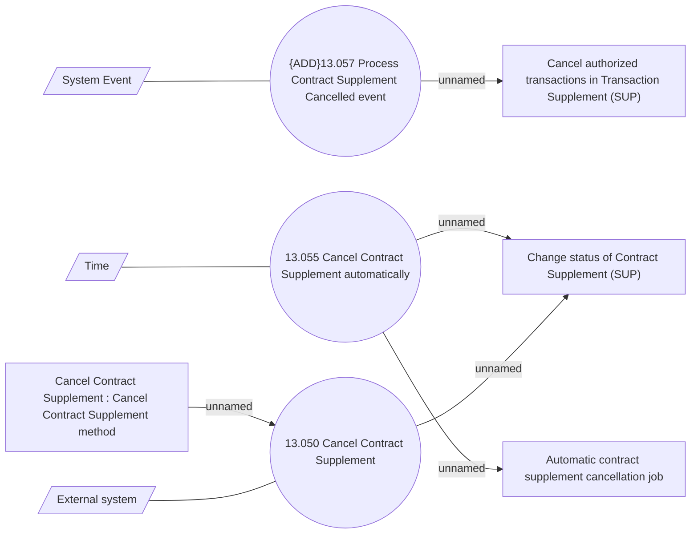

# Cancel Contract Supplement - Use case model

- **Diagram Type**: Use Case
- **Package**: HomerSelect/BSL/Modules/Supplements (SUP_NG)/Analytical Model/Contract Supplements/Use Case Model
- **Diagram ID**: 163944
- **Elements**: 10
- **Connectors**: 8

