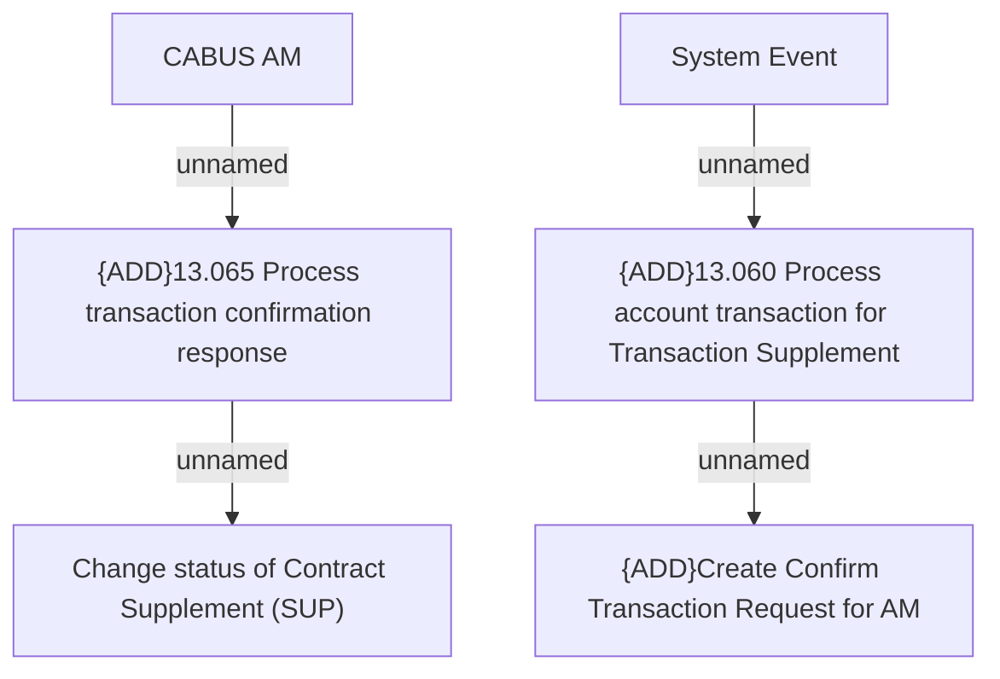

# Confirm Contract Supplement transactions - Use Case Model

```mermaid
graph TD
    Change_status_of_Contract_Supplement_SUP["Change status of Contract Supplement (SUP)"]
    CABUS_AM["CABUS AM"]
    ADD_13_065_Process_transaction_confirmation_response["{ADD}13.065 Process transaction confirmation response"]
    System_Event["System Event"]
    ADD_Create_Confirm_Transaction_Request_for_AM["{ADD}Create Confirm Transaction Request for AM"]
    ADD_13_060_Process_account_transaction_for_Transaction_Suppl["{ADD}13.060 Process account transaction for Transaction Supplement"]
    System_Event -->|unnamed| ADD_13_060_Process_account_transaction_for_Transaction_Suppl
    ADD_13_060_Process_account_transaction_for_Transaction_Suppl -->|unnamed| ADD_Create_Confirm_Transaction_Request_for_AM
    CABUS_AM -->|unnamed| ADD_13_065_Process_transaction_confirmation_response
    ADD_13_065_Process_transaction_confirmation_response -->|unnamed| Change_status_of_Contract_Supplement_SUP
```
