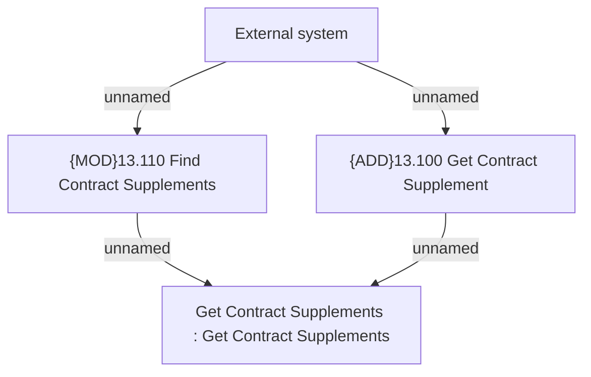

# Get Contract Supplements - Use Case Model

```mermaid
graph TD
    Get_Contract_Supplements_Get_Contract_Supplements["Get Contract Supplements : Get Contract Supplements"]
    External_system["External system"]
    MOD_13_110_Find_Contract_Supplements["{MOD}13.110 Find Contract Supplements"]
    ADD_13_100_Get_Contract_Supplement["{ADD}13.100 Get Contract Supplement"]
    External_system -->|unnamed| ADD_13_100_Get_Contract_Supplement
    External_system -->|unnamed| MOD_13_110_Find_Contract_Supplements
    MOD_13_110_Find_Contract_Supplements -->|unnamed| Get_Contract_Supplements_Get_Contract_Supplements
    ADD_13_100_Get_Contract_Supplement -->|unnamed| Get_Contract_Supplements_Get_Contract_Supplements
```
