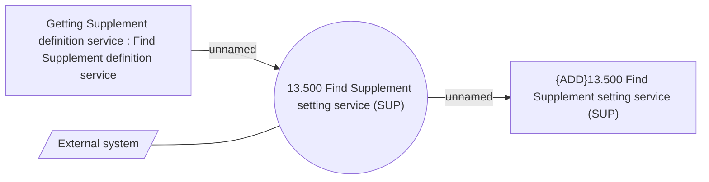

# Supplement definition - Use Case Model

- **Diagram Type**: Use Case
- **Package**: HomerSelect/BSL/Modules/Supplements (SUP_NG)/Analytical Model/Supplement definition/Use Case Model
- **Diagram ID**: 161696
- **Elements**: 4
- **Connectors**: 3

