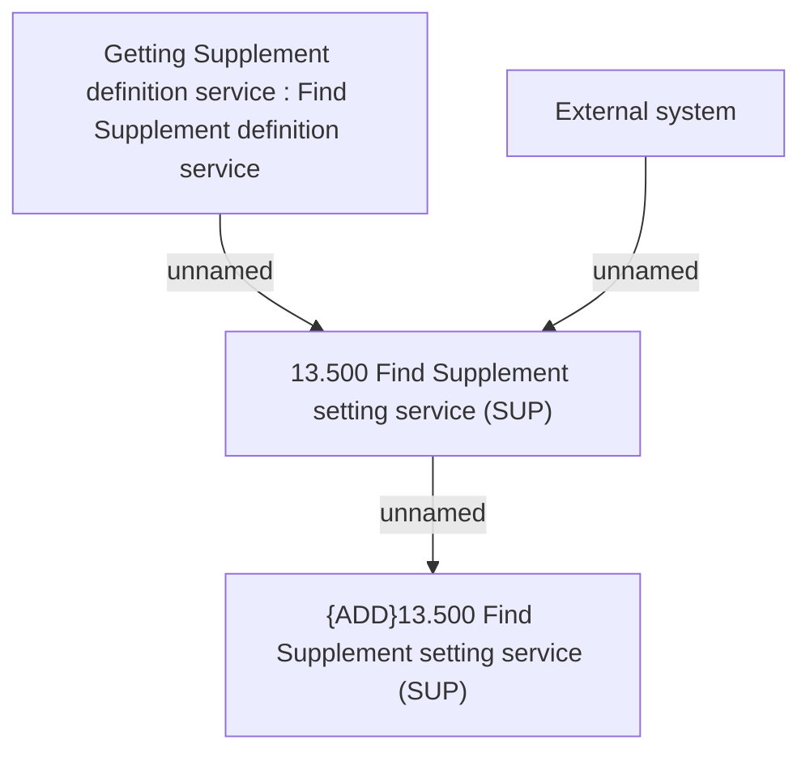

# Supplement definition - Use Case Model

```mermaid
graph TD
    Getting_Supplement_definition_service_Find_Supplement_defini["Getting Supplement definition service : Find Supplement definition service"]
    External_system["External system"]
    ADD_13_500_Find_Supplement_setting_service_SUP["{ADD}13.500 Find Supplement setting service (SUP)"]
    n_13_500_Find_Supplement_setting_service_SUP["13.500 Find Supplement setting service (SUP)"]
    Getting_Supplement_definition_service_Find_Supplement_defini -->|unnamed| n_13_500_Find_Supplement_setting_service_SUP
    n_13_500_Find_Supplement_setting_service_SUP -->|unnamed| ADD_13_500_Find_Supplement_setting_service_SUP
    External_system -->|unnamed| n_13_500_Find_Supplement_setting_service_SUP
```
