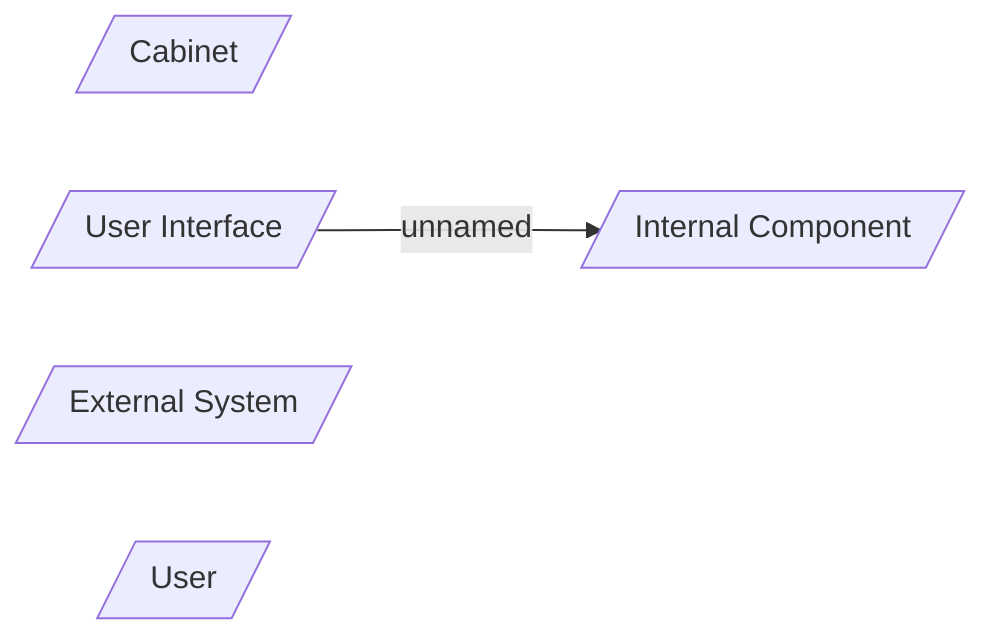

# Actors

- **Diagram Type**: Use Case
- **Package**: HomerSelect/BSL/Modules/Ticketing (TCK)/Actors
- **Diagram ID**: 163464
- **Elements**: 5
- **Connectors**: 1

```mermaid
graph LR
    Cabinet[/"Cabinet"/]
    User_Interface[/"User Interface"/]
    External_System[/"External System"/]
    Internal_Component[/"Internal Component"/]
    User[/"User"/]
    User_Interface -->|unnamed| Internal_Component
```
