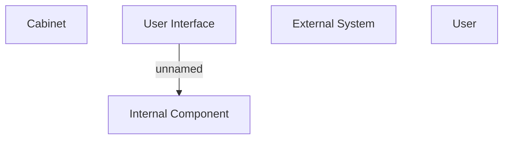

# Actors

```mermaid
graph TD
    Cabinet["Cabinet"]
    User_Interface["User Interface"]
    External_System["External System"]
    Internal_Component["Internal Component"]
    User["User"]
    User_Interface -->|unnamed| Internal_Component
```
