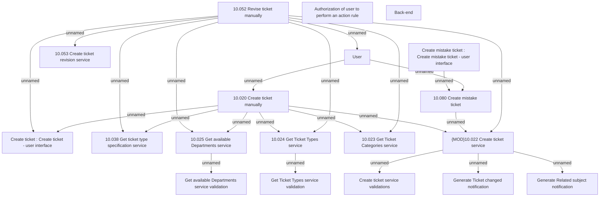

# Ticket creation - Use Case Model

```mermaid
graph TD
    Get_available_Departments_service_validation["Get available Departments service validation"]
    Get_Ticket_Types_service_validation["Get Ticket Types service validation"]
    Create_ticket_service_validations["Create ticket service validations"]
    Create_mistake_ticket_Create_mistake_ticket_user_interface["Create mistake ticket : Create mistake ticket - user interface"]
    Create_ticket_Create_ticket_user_interface["Create ticket : Create ticket - user interface"]
    Generate_Ticket_changed_notification["Generate Ticket changed notification"]
    Generate_Related_subject_notification["Generate Related subject notification"]
    n_10_053_Create_ticket_revision_service["10.053 Create ticket revision service"]
    n_10_052_Revise_ticket_manually["10.052 Revise ticket manually"]
    n_10_080_Create_mistake_ticket["10.080 Create mistake ticket"]
    Authorization_of_user_to_perform_an_action_rule["Authorization of user to perform an action rule"]
    n_10_038_Get_ticket_type_specification_service["10.038 Get ticket type specification service"]
    n_10_025_Get_available_Departments_service["10.025 Get available Departments service"]
    n_10_024_Get_Ticket_Types_service["10.024 Get Ticket Types service"]
    n_10_023_Get_Ticket_Categories_service["10.023 Get Ticket Categories service"]
    MOD_10_022_Create_ticket_service["{MOD}10.022 Create ticket service"]
    User["User"]
    n_10_020_Create_ticket_manually["10.020 Create ticket manually"]
    Back_end["Back-end"]
    n_10_052_Revise_ticket_manually -->|unnamed| n_10_025_Get_available_Departments_service
    n_10_024_Get_Ticket_Types_service -->|unnamed| Get_Ticket_Types_service_validation
    MOD_10_022_Create_ticket_service -->|unnamed| Create_ticket_service_validations
    n_10_052_Revise_ticket_manually -->|unnamed| Create_ticket_Create_ticket_user_interface
    n_10_020_Create_ticket_manually -->|unnamed| Create_ticket_Create_ticket_user_interface
    MOD_10_022_Create_ticket_service -->|unnamed| Generate_Ticket_changed_notification
    MOD_10_022_Create_ticket_service -->|unnamed| Generate_Related_subject_notification
    n_10_052_Revise_ticket_manually -->|unnamed| n_10_053_Create_ticket_revision_service
    Create_mistake_ticket_Create_mistake_ticket_user_interface -->|unnamed| n_10_080_Create_mistake_ticket
    n_10_025_Get_available_Departments_service -->|unnamed| Get_available_Departments_service_validation
    n_10_052_Revise_ticket_manually -->|unnamed| n_10_038_Get_ticket_type_specification_service
    n_10_020_Create_ticket_manually -->|unnamed| n_10_025_Get_available_Departments_service
    n_10_020_Create_ticket_manually -->|unnamed| n_10_024_Get_Ticket_Types_service
    n_10_052_Revise_ticket_manually -->|unnamed| n_10_024_Get_Ticket_Types_service
    n_10_020_Create_ticket_manually -->|unnamed| n_10_023_Get_Ticket_Categories_service
    n_10_052_Revise_ticket_manually -->|unnamed| n_10_023_Get_Ticket_Categories_service
    n_10_020_Create_ticket_manually -->|unnamed| MOD_10_022_Create_ticket_service
    n_10_080_Create_mistake_ticket -->|unnamed| MOD_10_022_Create_ticket_service
    n_10_052_Revise_ticket_manually -->|unnamed| MOD_10_022_Create_ticket_service
    n_10_052_Revise_ticket_manually -->|unnamed| User
    n_10_020_Create_ticket_manually -->|unnamed| n_10_038_Get_ticket_type_specification_service
    User -->|unnamed| n_10_020_Create_ticket_manually
    User -->|unnamed| n_10_080_Create_mistake_ticket
```
