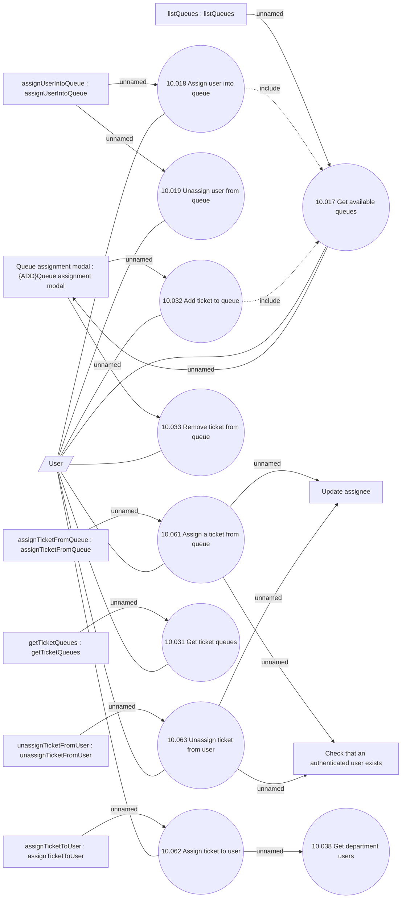

# Ticketing - Queue management

- **Diagram Type**: Use Case
- **Package**: HomerSelect/BSL/Modules/Ticketing (TCK)/Analytical Model/Use Case Model
- **Diagram ID**: 163033
- **Elements**: 20
- **Connectors**: 26

