# Ticketing - Ticket management

- **Diagram Type**: Use Case
- **Package**: HomerSelect/BSL/Modules/Ticketing (TCK)/Analytical Model/Use Case Model
- **Diagram ID**: 163030
- **Elements**: 49
- **Connectors**: 39

```mermaid
graph LR
    Ticketing_Change_ticket_status_API_usage_Ticketing_Change_ti["Ticketing - Change ticket status API usage : Ticketing - Change ticket status API usage"]
    Ticketing_Search_for_ticket_usage_Ticketing_search_for_ticke["Ticketing - Search for ticket usage : Ticketing - search for ticket usage"]
    Ticket_detail_Ticket_detail_user_interface["Ticket detail : Ticket detail - user interface"]
    Attach_file_to_ticket_Attach_file_to_ticket_user_interface["Attach file to ticket : Attach file to ticket - user interface"]
    ADD_Add_comment_to_ticket_ADD_Add_comment_to_ticket_user_int["{ADD}Add comment to ticket : {ADD}Add comment to ticket - user interface"]
    Attach_file_to_ticket_Attach_file_to_ticket_user_interface["Attach file to ticket : Attach file to ticket - user interface"]
    Ticket_detail_Ticket_detail_user_interface["Ticket detail : Ticket detail - user interface"]
    Assign_ticket_to_department_Assign_ticket_to_department_user["Assign ticket to department : Assign ticket to department - user interface"]
    My_overview_ADD_My_overview_form["My overview : {ADD}My overview form"]
    Search_for_Tickets_Search_for_Tickets_user_interface["Search for Tickets : Search for Tickets - user interface"]
    Change_ticket_status_Change_ticket_status_user_interface["Change ticket status : Change ticket status - user interface"]
    n_10_100_Show_My_overview(("10.100 Show My overview"))
    Personalize_GUI(("Personalize GUI"))
    n_10_039_Get_Mistake_Tickets_Count_on_Contracts(("10.039 Get Mistake Tickets Count on Contracts"))
    n_10_051_Add_comment_to_ticket(("10.051 Add comment to ticket"))
    n_10_071_Take_and_attach_photo_file_to_ticket(("10.071 Take and attach photo file to ticket"))
    Definition_inactive_Ticket_statuses_rule["Definition inactive Ticket statuses rule"]
    n_10_037_Get_user_detail_service(("10.037 Get user detail service"))
    n_10_036_Update_user_setting_service(("10.036 Update user setting service"))
    n_10_035_Get_ticket_counts_service(("10.035 Get ticket counts service"))
    Redirect_links_rule["Redirect links rule"]
    n_10_034_Create_related_subject_to_ticket_service(("10.034 Create related subject to ticket service"))
    n_10_016_Get_Search_types_service(("10.016 Get Search types service"))
    Get_Mistake_Rules_service_validations["Get Mistake Rules service validations"]
    n_10_085_Get_Mistake_Rules_service(("10.085 Get Mistake Rules service"))
    Cabinet[/"Cabinet"/]
    Attach_a_file_to_ticket_service_validations["Attach a file to ticket service validations"]
    n_10_075_Download_a_ticket_attachment(("10.075 Download a ticket attachment"))
    n_10_072_Attach_a_file_to_ticket_service(("10.072 Attach a file to ticket service"))
    n_10_070_Attach_a_file_to_ticket(("10.070 Attach a file to ticket"))
    n_10_050_Assign_ticket_to_department(("10.050 Assign ticket to department"))
    Change_ticket_status_service_validations["Change ticket status service validations"]
    Get_ticket_rules_service_validation["Get ticket rules service validation"]
    Show_ticket_detail_service_validation["Show ticket detail service validation"]
    Search_for_tickets_service_validations["Search for tickets service validations"]
    ResolutionTime_calculation_rule["ResolutionTime calculation rule"]
    ResponseTime_calculation_rule["ResponseTime calculation rule"]
    n_10_062_Change_ticket_status_service(("10.062 Change ticket status service"))
    n_10_028_Get_ticket_rules_service(("10.028 Get ticket rules service"))
    n_10_060_Change_ticket_status(("10.060 Change ticket status"))
    n_10_027_Get_Ticket_Statuses_service(("10.027 Get Ticket Statuses service"))
    n_10_026_Get_Ticket_Priorities_service(("10.026 Get Ticket Priorities service"))
    n_10_032_Show_ticket_detail_service(("10.032 Show ticket detail service"))
    MOD_10_012_Search_for_tickets_service(("{MOD}10.012 Search for tickets service"))
    n_10_030_Show_ticket_detail(("10.030 Show ticket detail"))
    n_10_010_Search_for_tickets(("10.010 Search for tickets"))
    User[/"User"/]
    Front_end["Front-end"]
    Back_end["Back-end"]
    n_10_072_Attach_a_file_to_ticket_service -->|unnamed| Attach_a_file_to_ticket_service_validations
    Assign_ticket_to_department_Assign_ticket_to_department_user -->|unnamed| n_10_050_Assign_ticket_to_department
    Attach_file_to_ticket_Attach_file_to_ticket_user_interface -->|unnamed| n_10_070_Attach_a_file_to_ticket
    n_10_070_Attach_a_file_to_ticket -->|unnamed| n_10_072_Attach_a_file_to_ticket_service
    n_10_071_Take_and_attach_photo_file_to_ticket -->|unnamed| n_10_072_Attach_a_file_to_ticket_service
    n_10_028_Get_ticket_rules_service -->|unnamed| Get_ticket_rules_service_validation
    n_10_085_Get_Mistake_Rules_service -->|unnamed| Get_Mistake_Rules_service_validations
    MOD_10_012_Search_for_tickets_service -->|unnamed| Definition_inactive_Ticket_statuses_rule
    Attach_file_to_ticket_Attach_file_to_ticket_user_interface -->|unnamed| n_10_071_Take_and_attach_photo_file_to_ticket
    ADD_Add_comment_to_ticket_ADD_Add_comment_to_ticket_user_int -->|unnamed| n_10_051_Add_comment_to_ticket
    n_10_030_Show_ticket_detail -.->|extend| n_10_100_Show_My_overview
    My_overview_ADD_My_overview_form -->|unnamed| n_10_100_Show_My_overview
    Ticket_detail_Ticket_detail_user_interface -->|unnamed| n_10_075_Download_a_ticket_attachment
    Ticketing_Change_ticket_status_API_usage_Ticketing_Change_ti -->|unnamed| n_10_062_Change_ticket_status_service
    Search_for_Tickets_Search_for_Tickets_user_interface -->|unnamed| n_10_010_Search_for_tickets
    Ticket_detail_Ticket_detail_user_interface -->|unnamed| n_10_030_Show_ticket_detail
    n_10_010_Search_for_tickets -->|unnamed| MOD_10_012_Search_for_tickets_service
    n_10_030_Show_ticket_detail -->|unnamed| n_10_032_Show_ticket_detail_service
    Ticketing_Search_for_ticket_usage_Ticketing_search_for_ticke -->|unnamed| n_10_027_Get_Ticket_Statuses_service
    n_10_062_Change_ticket_status_service -->|unnamed| Change_ticket_status_service_validations
    n_10_050_Assign_ticket_to_department -->|unnamed| n_10_062_Change_ticket_status_service
    n_10_060_Change_ticket_status -->|unnamed| n_10_062_Change_ticket_status_service
    n_10_051_Add_comment_to_ticket -->|unnamed| n_10_062_Change_ticket_status_service
    n_10_062_Change_ticket_status_service -->|unnamed| ResponseTime_calculation_rule
    n_10_062_Change_ticket_status_service -->|unnamed| ResolutionTime_calculation_rule
    MOD_10_012_Search_for_tickets_service -->|unnamed| Search_for_tickets_service_validations
    n_10_032_Show_ticket_detail_service -->|unnamed| Show_ticket_detail_service_validation
    n_10_051_Add_comment_to_ticket --> User
    Change_ticket_status_Change_ticket_status_user_interface -->|unnamed| n_10_060_Change_ticket_status
    Cabinet --> n_10_072_Attach_a_file_to_ticket_service
    Cabinet --> n_10_075_Download_a_ticket_attachment
    User --> n_10_075_Download_a_ticket_attachment
    User --- n_10_100_Show_My_overview
    User --> n_10_010_Search_for_tickets
    User --> n_10_070_Attach_a_file_to_ticket
    User --> n_10_050_Assign_ticket_to_department
    User --> n_10_071_Take_and_attach_photo_file_to_ticket
    User --> n_10_060_Change_ticket_status
    User --> n_10_030_Show_ticket_detail
```

